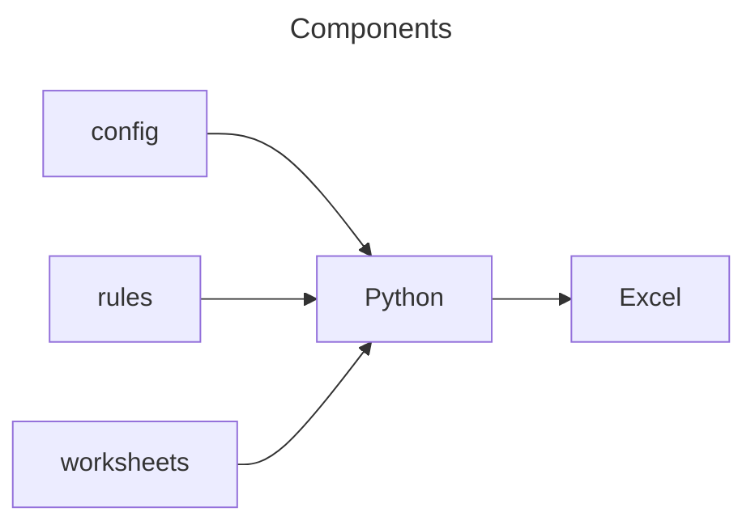

# Developers

- [Developers](#developers)
  - [Design](#design)
  - [File overview](#file-overview)
    - [`csv_excel\`](#csv_excel)
      - [`csv_excel\vbaProject.bin`](#csv_excelvbaprojectbin)
  - [Developing](#developing)
    - [Install package locally for developing](#install-package-locally-for-developing)
    - [Update pypi version](#update-pypi-version)
    - [Executing unit tests](#executing-unit-tests)

## Design



## File overview

### `csv_excel\`
#### `csv_excel\vbaProject.bin`
This is a binary file to be included in generated Excel files.
It contains the following VB macro, which handles auto exporting all worksheets to their respective CSV file.

> [!TIP]
> It might be better to change the `FileFormat:=xlCSV` to `FileFormat:=xlCSVUTF8` for UTF8 CSV files.

```vb
Option Explicit

Sub SaveSheetAsCSV()
    Dim ws As Worksheet
    Dim csvFile As String
    
    For Each ws In Worksheets
        ws.Copy
        csvFile = ThisWorkbook.Path & "\" & ws.Name & ".csv"
        Rem Don't prompt, just overwrite CSV files
        Application.DisplayAlerts = False
        Application.ActiveWorkbook.SaveAs Filename:=csvFile, FileFormat:=xlCSV, CreateBackup:=False, ConflictResolution:=xlLocalSessionChanges
        Application.ActiveWorkbook.Saved = True
        Application.ActiveWorkbook.Close
    Next
End Sub

Private Sub Workbook_BeforeSave(ByVal SaveAsUI As Boolean, Cancel As Boolean)
    SaveSheetAsCSV
End Sub
```

[top](#developers)

## Developing

### Install package locally for developing

```bash
pip uninstall -y erichschroeter.csv-excel
python3 -m build
pip install dist/erichschroeter.csv_excel-0.1.0-py3-none-any.whl
```

[top](#developers)

### Update pypi version

```bash
python3 -m build
python3 -m twine upload --repository testpypi dist/*
```

[top](#developers)

### Executing unit tests
The following command will execute the unit tests.

```bash
python -m unittest
```

or, using [pytest](https://docs.pytest.org/en/6.2.x/):

```bash
python -m venv .venv
. .venv/bin/activate
pip install -r requirements-dev.txt
python -m pytest
```

[top](#developers)
